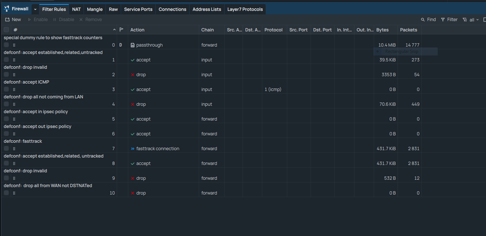
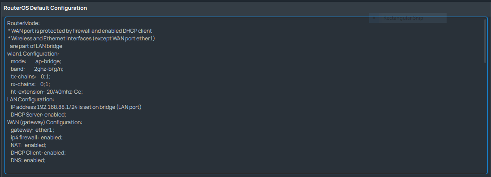
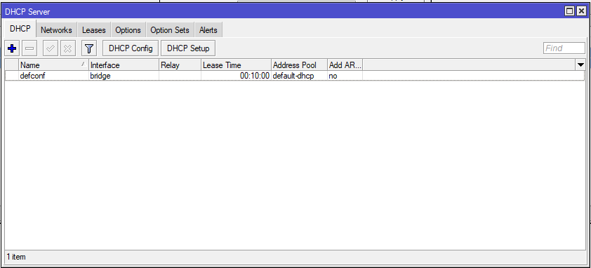

# LAB-2
Selasa 12 Agustus 2025  
  
# Default COnfiguration Mikrotik  
  Saat pertamakali menjalankan Mikrotik dengan default configuration kita tidak bisa mengakses dengan port ether1, karna firewall memblokir akses selain LAN, sedangkan port ether1 adalah WAN.  Bisa dilihat di **Firewalls > Filter Rules**
    
  Dan untuk melihat interface WAN (Wide Area Network) itu yang mana, kita bisa lihat di **Interfaces > Interfaces List**  
    
  Saat sudah login akan tampil/muncul pop up window yang berisi keterangan apa saja konfigurasi default mikrotik.  
    
  Pada gambar diatas, terlihat bahwa beberapa konfigurasi default Mikrotik antara lain:  
  1. WLAN Configuration  
  
  **wlan1** dikonfigurasi dalam mode ap-bridge pada band frekuensi 2.4 GHz. ht-extension diatur 20/40 MHz-Ce untuk menyesuaikan antara kestabilan dan kecepatan. TX/RX chains 0,1 artinya router memakai dua antena sekaligus (chain 0 dan chain 1) untuk mengirim (TX) dan menerima (RX) sinyal, supaya sinyal lebih kuat dan throughput lebih baik.  
  2. LAN Configuration  
  Pada LAN, alamat IP default adalah 192.168.88.1/24. DHCP Server aktif, sehingga setiap perangkat yang terhubung ke Mikrotik akan memperoleh IP address secara otomatis.  

  4. WAN Configuration
  Gateway diarahkan ke port ether1. Firewall IPv4 aktif, NAT berfungsi membagi alamat IP publik dari ISP ke seluruh perangkat LAN, dan DNS mengonversi nama domain menjadi alamat IP. Dengan konfigurasi ini, router dapat langsung digunakan hanya dengan menghubungkan kabel internet ke ether1.
